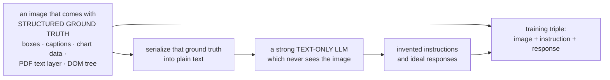
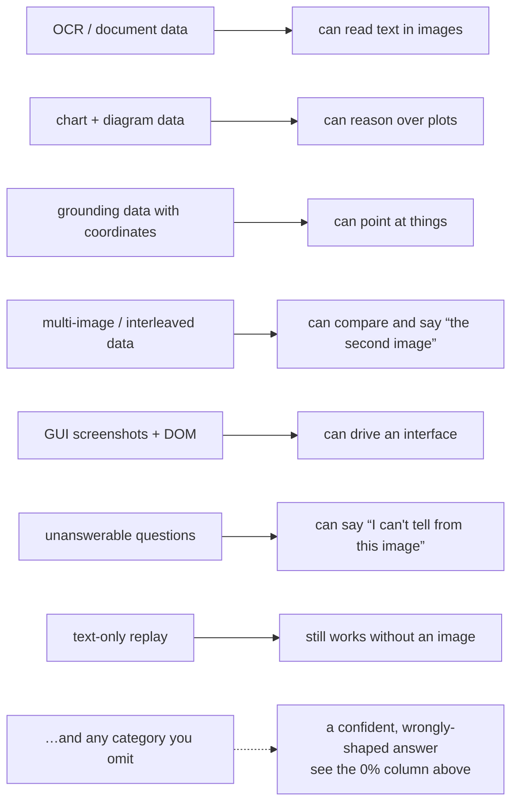

# Visual Instruction Tuning and VLM Data

**Phase:** [Vision-Language Models](../README.md) · **Topic folder:** `06-Visual-Instruction-Tuning-and-VLM-Data`

## Why this matters

[Lesson 5](../05-Training-a-VLM-Staged-Pipeline/README.md) settled the schedule: what to freeze, at which learning rate, in which order. It left the most consequential variable untouched — *what is in the training examples*. Between two VLMs with identical architectures, identical towers, and identical schedules, the difference in what they can do is almost entirely a difference in their instruction data, and that difference is not subtle. A model tuned only on short VQA answers will answer every request with a short VQA answer, including "describe this diagram in detail." A model that never saw an image with text in it will confidently invent what a sign says. This lesson is [Phase 05 Lesson 4](../../Phase-05-Finetuning-LLMs/04-Instruction-Tuning-SFT/README.md)'s argument in the multimodal setting, where it is sharper, because visual instruction data barely exists naturally and must be manufactured.

## Orientation: what an example looks like

**Visual instruction tuning** is supervised fine-tuning ([Phase 05 Lesson 4](../../Phase-05-Finetuning-LLMs/04-Instruction-Tuning-SFT/README.md)) where part of the instruction is an image. One training example is a **triple**:

| Field | Example |
|---|---|
| image | a photo of a kitchen |
| instruction | "How many chairs are at the table?" |
| response | "Three." |

and the loss is applied to the response only ([Lesson 5 §4](../05-Training-a-VLM-Staged-Pipeline/README.md#4-loss-masking)). The difficulty is not the format — it is that these triples barely occur naturally. The web has billions of (image, caption) pairs and almost no (image, instruction, response) triples, so **the data has to be manufactured**, and every capability the finished model has traces back to a decision someone made while manufacturing it. That is what this lesson measures.

## What this lesson covers

- What a visual instruction example actually is, and why LLaVA had to invent them
- The GPT-assisted synthesis trick that created the field's first instruction set
- Measured: task coverage vs. per-task accuracy at a fixed example budget
- Measured: phrasing diversity, template overfitting, and the level-vs-drop distinction
- Measured: what it costs to add a capability the mixture was missing
- The task types a modern mixture has to contain, and where each comes from
- Quality control: dedup, decontamination, and the risks of synthetic data

## 1. What visual instruction data is, and where it comes from

An example is a triple: an image, an instruction, and the response you want. The problem in 2023 was that nothing like this existed at scale. Image-caption pairs existed by the billion, but a caption is not an instruction and captions do not teach a model to answer questions, follow formatting requests, refuse impossible ones, or reason across a chart's axes.

LLaVA's solution defined the genre. Take images from an existing dataset that has **rich symbolic annotations** — COCO, with its object boxes and multiple human captions — serialize those annotations into text, and hand *only that text* to a strong text-only LLM (GPT-4 at the time) with an instruction to invent conversations, detailed descriptions, and complex reasoning questions about the scene. The LLM never sees the image; it works from the annotations, so its answers are grounded in something real rather than in its own guesses. The output is (image, instruction, response) triples at whatever volume you can pay for.



The generator never seeing the image is the load-bearing detail: it writes about annotations that are known to be true, so it cannot invent objects. Its errors are errors of *emphasis* rather than of fact — which is a far safer failure mode than asking a VLM to caption images it may misread.

Nearly every visual instruction set since is a variation on that move: find a source of reliable structured truth about an image (annotations, rendering code for a chart, a PDF's text layer, a DOM tree for a screenshot, an accessibility tree for a UI), and use a language model to convert it into instructions and answers.

## 2. Coverage decides capability

`example.py` holds everything constant except the mixture — same architecture, same initialization, same ~96,000 training examples — and varies which tasks those examples cover. Five instruction types are defined over a scene of five objects; `COLOR_LEFT` (the colour of the object to the left of the named one) is **never trained by any run** and exists to test whether composing two learned skills comes for free.

```
trained on                COLOR_OF       COUNT      EXISTS     LEFT_OF  COLOR_LEFT
----------------------------------------------------------------------------------
COLOR_OF only              100.0%       0.0%       0.0%       0.0%      21.7%
COLOR_OF + COUNT           100.0%      98.9%       0.0%       0.0%      21.7%
all 4 trained tasks        100.0%      83.1%      99.8%      92.8%      11.3%
chance                      20.0%      16.7%      50.0%      10.0%      20.0%
```

**Zero, not chance.** The single-task model doesn't score at chance on the tasks it never saw — it scores 0%, because it answers every instruction with the kind of token its training data used. Ask a `COLOR_OF`-tuned model "how many?" and it names a colour. It can see the image perfectly; it simply does not know what any other instruction means, and it fails *confidently and in the wrong format*. This is the most common way real VLMs disappoint: they do what their instruction data covered and produce plausible nonsense elsewhere.

**Coverage is cheap.** Splitting the same budget four ways makes the model useful on all four tasks, with a modest per-task cost (COUNT drops as it gives up three quarters of its data). That trade is why real instruction sets are mixtures of dozens of task types rather than one large corpus of a single type.

**Composition is not free.** `COLOR_LEFT` stays at chance for every mixture. The model can report a colour and can find the object to the left, and cannot combine the two, because nothing asked it to. At this scale, the parts do not imply the whole. Real VLMs show the same pattern in more consequential places: a model that reads text and a model that reasons about tables is not automatically a model that reads a table *in an image*.

## 3. Phrasing diversity

Same tasks, same budget; the only difference is how many wordings each instruction gets during training. Evaluation includes a phrasing no run trained on:

```
trained with                 seen phrasing   UNSEEN phrasing    drop
1 phrasing                          80.9%            74.4%      6.5%
3 phrasings                         93.9%            92.6%      1.3%
```

Two distinct effects, and the smaller one is the famous one. The **drop** is template overfitting: a model trained on one wording was never given a reason to treat wording as irrelevant, so rewording costs it points. The **level** matters more: the multi-phrasing model is 13 points better even on wording it *did* train on. Phrasing variety acts as augmentation — it forces the model to key on what the phrasings share (the task) instead of on a surface shortcut. Both effects push the same way, which is why instruction sets are generated with many templates per task, and why "scores well on the benchmark, brittle in users' hands" usually traces back to a template-poor tuning set rather than to the model.

## 4. Adding a missing capability

```
                                     COLOR_LEFT   other 4 (avg)
4-task mixture (no COLOR_LEFT)           10.9%          93.9%
5-task mixture (with COLOR_LEFT)         49.8%          79.2%
```

Adding the missing task — at the same total budget, so every other task lost a fifth of its data — takes it from chance to far above chance, and the others pay a real but bounded price. That asymmetry is the economics of instruction tuning: **coverage of a capability you lack buys more than more examples of one you have**, up to the point where the mixture is broad and the marginal task is rare. It is also why so much effort goes into manufacturing data for skills no naturally occurring image-text corpus contains.

## 5. What a modern mixture contains

| Category | Typical source | What it teaches |
|---|---|---|
| Detailed captioning | LLM-rewritten dense captions | long-form description, format control |
| Conversational VQA | LLaVA-style synthesis from annotations | multi-turn dialogue about an image |
| Academic VQA | VQAv2, GQA, OK-VQA reformatted with instructions | short-answer accuracy, benchmark format |
| **OCR & documents** | rendered PDFs/receipts with their text layer as truth | reading text in images at all |
| **Charts & diagrams** | charts rendered from known data; the data is the answer key | structured visual reasoning |
| **Grounding** | detection datasets; boxes serialized as coordinate text | pointing, referring expressions ([Lesson 8](../08-VLM-Capabilities-Grounding-OCR-Video-GUI/README.md)) |
| Multi-image / interleaved | curated pairs, image sequences, web documents | comparison, "the second image", context across images |
| **GUI / agentic** | screenshots + accessibility trees or DOM | element identification, UI actions |
| Math & science with figures | textbook-style problems with diagrams | visual chain-of-thought |
| Refusals & unanswerables | questions deliberately not answerable from the image | saying "I can't tell from this image" ([Lesson 7](../07-VLM-Hallucination-and-Alignment/README.md)) |
| **Text-only replay** | the LLM's own SFT data | not losing what the LLM already had (Lesson 5 §3) |



The bolded rows are the ones that separate a demo-quality VLM from a useful one, and all of them are synthetic-by-construction: you generate the image and the ground truth together (render a chart from data you chose, screenshot a page whose DOM you have), so the label is exact rather than annotated.

The **unanswerables** row deserves particular attention. If every training example has an answer derivable from the image, you have trained the model that an answer always exists — which is a large part of why VLMs hallucinate rather than decline. That link is [Lesson 7](../07-VLM-Hallucination-and-Alignment/README.md)'s subject.

## 6. Quality control

- **Decontaminate against your evaluation sets.** Instruction data synthesized from public datasets frequently draws on images that appear in benchmarks. [Lesson 9](../09-Evaluating-VLMs/README.md) covers how badly this distorts reported numbers.
- **Deduplicate images, not just text.** The same photo appears across many source datasets with different annotations.
- **Watch for teacher artifacts.** Data generated by a stronger VLM inherits that model's verbosity, formatting tics, refusal style, and factual errors — you are distilling its behaviour, warts included ([Phase 09 Lesson 5](../../Phase-09-Deployment-and-Inference-Optimization/05-Model-Distillation-and-Pruning/README.md)).
- **Verify what can be verified.** For rendered charts, generated documents, and detection-derived grounding, the answer key is computable; use it rather than trusting the generator. This is the single largest quality difference between good and mediocre synthetic sets.
- **Answer-length balance.** Mixing short-answer VQA with long-form description without balancing them produces a model that gives one-word answers to open-ended questions, or paragraphs to yes/no questions. LLaVA-1.5's fix was explicit format instructions in the short-answer data.

## Video Script Outline

1. Why visual instruction data has to be manufactured — captions are not instructions
2. LLaVA's synthesis trick: annotations as ground truth, a text-only LLM as the generator
3. The coverage table: 0% (not chance) on untrained tasks, and what "confidently wrong format" looks like
4. Diversity at a fixed budget: what four tasks cost each other
5. Composition is not free — the held-out `COLOR_LEFT` result
6. Phrasing diversity: the drop everyone talks about, and the level effect that matters more
7. Adding the missing capability: chance → competent, at a bounded cost to the rest
8. The mixture table, and why the bolded rows are all synthetic-by-construction
9. Unanswerables, and the bridge to hallucination
10. Quality control: decontamination, dedup, teacher artifacts, verifiable answer keys
11. Recap + preview of [Lesson 7](../07-VLM-Hallucination-and-Alignment/README.md)

## Further Reading

- Liu, Li, Wu, Lee (2023), *Visual Instruction Tuning* (the GPT-assisted data synthesis that started the genre)
- Liu et al. (2023), *Improved Baselines with Visual Instruction Tuning* (LLaVA-1.5's mixture, format prompts, and academic-VQA blending)
- Dai et al. (2023), *InstructBLIP* (a large held-out-task study of instruction-tuning generalization)
- Tong et al. (2024), *Cambrian-1: A Fully Open, Vision-Centric Exploration of Multimodal LLMs* (systematic instruction-mixture curation and its effect on capability)
- Laurençon et al. (2024), *The Cauldron / Idefics2* (an open, explicitly documented mixture of 50+ instruction datasets)
