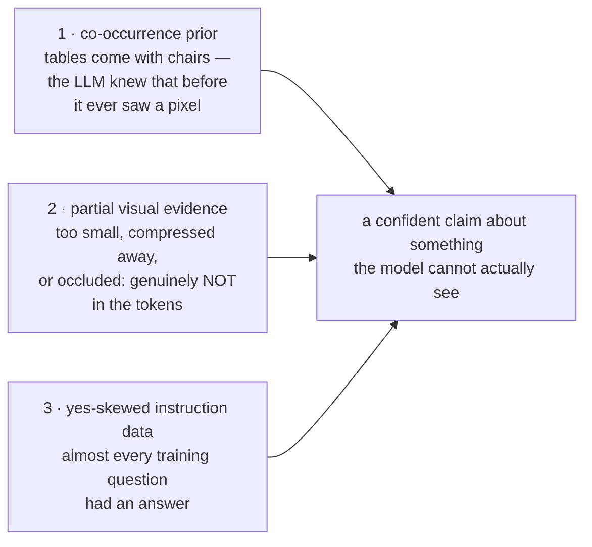
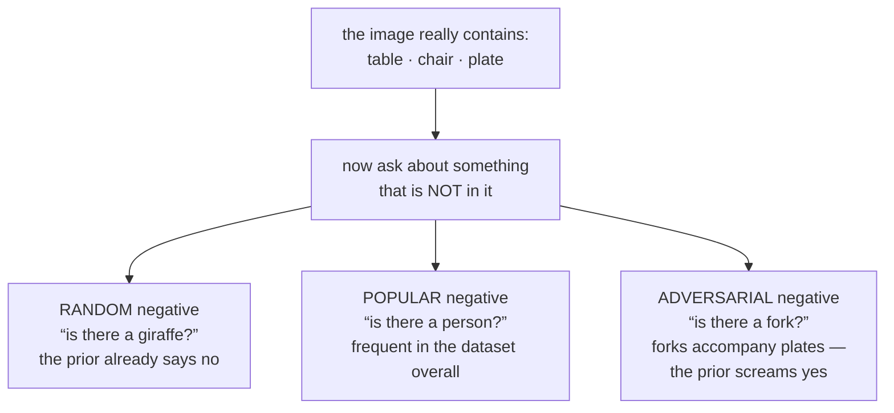
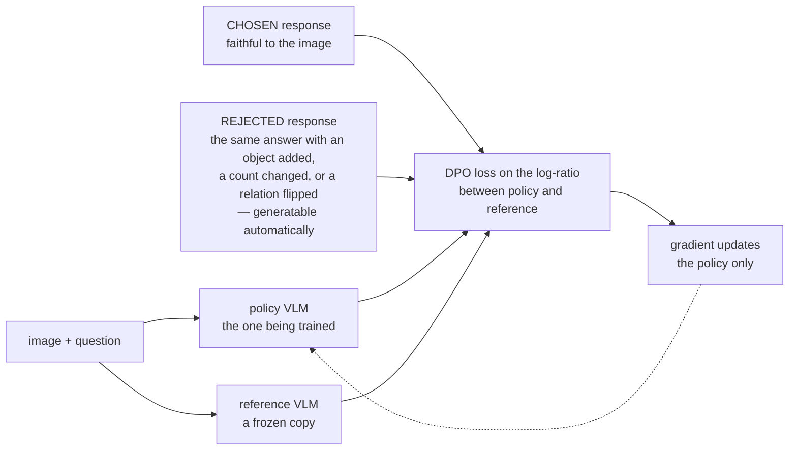

# VLM Hallucination and Alignment

**Phase:** [Vision-Language Models](../README.md) · **Topic folder:** `07-VLM-Hallucination-and-Alignment`

## Why this matters

A text LLM hallucinates when it asserts a fact it has no basis for. A VLM does something more specific and, in some ways, worse: it asserts facts about an image *that is right there in its context*, contradicting evidence it was given. It reports a chair that isn't in the photo, counts four people where there are three, says "left" when the object is on the right, or reads text off a sign that is too small for its encoder to resolve. [Phase 08 Lesson 6](../../Phase-08-Evaluation-of-LLMs/06-VLM-as-a-Judge/README.md) met these failure modes from the evaluator's side; this lesson is about where they come from and what actually removes them. The short version, which the rest of the lesson makes measurable: hallucination is what a model does when the visual evidence is missing or weak and a strong prior is available to fill the gap — and every stage of this phase, from the tower's resolution to the connector's compression to the instruction data's yes-skew, controls one of those two terms.

## Orientation: two words, and why the second one is different

**Hallucination**, for a VLM, means asserting something about the image that is not true of it. **Alignment** means changing the model's behaviour to match what people actually want — here, to stop guessing. Both terms carry over from [Phase 06](../../Phase-06-Alignment-and-RLHF/README.md), but the multimodal case differs in one way that changes what fixes work:

| | Text LLM | VLM |
|---|---|---|
| The evidence is… | somewhere in the training data, or nowhere | *right there in the context window* |
| So a wrong claim means… | the model never knew, or misremembered | the model failed to look — **or the evidence never survived the encoder** |
| Which makes the fix… | better data, retrieval, calibration | that, **plus** resolution, tiling and connector choices from Lessons 1 and 4 |

That last row is the practical heart of this lesson. A VLM hallucination is frequently not a language failure at all: the object was 12 pixels wide, the tower ran at 336px, the connector merged four patches into one, and by the time the language model was reached there was nothing left to look at. Alignment can stop the model from *guessing confidently* in that situation; it cannot put the missing pixels back.

## What this lesson covers

- The three ingredients of a VLM hallucination: co-occurrence priors, partial visual evidence, and yes-skewed training data
- The blind-baseline diagnostic: how much of a benchmark score needs no image at all
- POPE and its three negative-sampling regimes, and why quoting one number is meaningless
- CHAIR, and metrics for open-ended captioning
- Alignment for VLMs: RLHF-V, POVID, and DPO on grounded preference pairs — implemented and measured
- What alignment does *not* fix, and the mitigations that are not alignment at all

## 1. Three ingredients

**Co-occurrence priors.** Real images are not random collections of objects. Tables come with chairs, streets with cars, kitchens with sinks. An LLM trained on text has these correlations baked in before it ever sees a pixel, and they are genuinely useful — until they substitute for looking.

**Partial visual evidence.** This is the ingredient most discussions skip. A VLM does not have the image; it has whatever survived the tower's resolution ([Lesson 1](../01-Vision-Encoders-and-Image-Tokenization/README.md)), its pretraining objective's compression ([Lesson 2 §4](../02-Vision-Language-Pretraining-Objectives/README.md#4-what-contrastive-pretraining-destroys)), and the connector's token budget ([Lesson 4](../04-Connectors-and-Visual-Token-Compression/README.md)). A small object in a 336px image may simply not be represented in the tokens at all. When the question is about something the tokens don't contain, the model is not "ignoring the image" — the evidence isn't there, and the prior is all that's left.

**Yes-skewed instruction data.** Most VQA training data answers questions that *have* answers, and existence questions skew heavily toward "yes." A model tuned on that data learns an affirmative prior on top of everything else.



`example.py` builds a world with all three under explicit control: 12 object types in correlated groups, each present object reaching the model's vision tokens only with probability 0.6, and a tunable yes-fraction in the training data.

```
model                                 accuracy  yes-rate   halluc.   misses
BLIND (no vision at all)                65.0%    55.1%     40.1%    29.8%
grounded, 80% YES training data         74.2%    70.7%     46.5%     5.0%
grounded, balanced training data        83.9%    46.6%     12.8%    19.5%
```

Two results worth sitting with. The **blind model scores 65%** on a balanced yes/no benchmark while being structurally incapable of seeing anything — pure co-occurrence prior. And the **yes-skewed model is worse than the balanced one** despite identical architecture and identical images: it inherits the data's affirmative prior, and its errors are almost entirely hallucinations (46.5%) rather than misses (5.0%). The data mixture decision from [Lesson 6](../06-Visual-Instruction-Tuning-and-VLM-Data/README.md) shows up here as a hallucination rate.

## 2. Measuring it: POPE

POPE (Li et al., 2023) turns hallucination into something countable: for each image, ask a balanced set of "Is there a {object}?" questions, half about objects that are present and half about objects that are not. Accuracy on the negatives is the hallucination measure. Its real contribution is noticing that **which absent objects you ask about changes everything**, and defining three regimes: `random` (any absent object), `popular` (absent objects that are frequent in the dataset overall), and `adversarial` (absent objects that most often co-occur with the objects that *are* present).

```
negatives are chosen from                                 acc   halluc.
random        any absent object                         74.2%     46.5%
popular       absent objects that are common overall    66.3%     62.2%
adversarial   absent objects that co-occur with the scene 73.3%     49.4%
```

One model, one set of images, three scores spanning eight points of accuracy and sixteen of hallucination rate — and `random`, the number a paper would quote if it quoted only one, is the easiest. Both harder regimes work by aiming at the prior rather than at the model's eyesight; which of the two bites harder depends on which prior dominates the data (here, overall object frequency). **A hallucination number without its negative-sampling regime is not a number.**



Two companions to POPE belong in any real evaluation:

- **The blind baseline.** Run your benchmark through a text-only model. Whatever it scores is the part of your benchmark that measures priors, not vision. [Lesson 9](../09-Evaluating-VLMs/README.md) makes this a general rule, because it applies to far more than hallucination benchmarks.
- **Both error types, plus the yes-rate.** A model that always answers "no" has a 0% hallucination rate. Reporting hallucination without the miss rate rewards exactly that degenerate behaviour.

For open-ended captioning rather than yes/no questions, **CHAIR** is the standard: parse the objects mentioned in a generated caption, compare against the image's ground-truth object list, and report the fraction of mentioned objects that aren't there (per-instance and per-sentence). It requires an annotated object vocabulary, which is why POPE's discriminative format became more popular — but CHAIR measures the failure in the format users actually encounter.

## 3. Fixing it: DPO on grounded preference pairs

The alignment machinery from [Phase 06](../../Phase-06-Alignment-and-RLHF/README.md) transfers to VLMs with one change: **what the preference pairs differ on**. In text RLHF, the preferred response is more helpful or more harmless. In multimodal alignment (RLHF-V, POVID, and their descendants), the preferred response is the one *faithful to the image*, and the rejected one is a deliberately corrupted version of it — the same answer with an object added, a count changed, or a relation flipped. That corruption can be generated automatically, which is what makes the approach scale.



`example.py` implements [DPO](../../Phase-06-Alignment-and-RLHF/04-Direct-Preference-Optimization-DPO/README.md) exactly as Phase 06 defines it — a frozen reference model, the `β`-scaled log-ratio, `−log σ(β[(π_c − ref_c) − (π_r − ref_r)])` — on pairs where chosen = grounded answer and rejected = hallucinated answer:

```
                            accuracy  yes-rate   hallucination rate
random, before DPO            74.2%    70.7%               46.5%
random, after  DPO            82.8%    48.9%               16.2%
popular, before DPO           66.3%    78.6%               62.2%
popular, after  DPO           74.7%    57.1%               32.4%
adversarial, before DPO       73.3%    72.8%               49.4%
adversarial, after  DPO       84.8%    49.3%               13.8%
```

Hallucination falls by roughly two-thirds on the adversarial split, accuracy rises on every split, and the yes-rate moves from ~72% to ~49%. That last column is the clearest statement of what the update actually did: it removed the affirmative prior the SFT data installed, rather than teaching the model to see better.

Which is also the limit. **DPO cannot conjure evidence that isn't in the tokens.** In this simulation 40% of present objects never reach the model, and no preference optimization can recover them; what alignment fixes is the model's willingness to guess confidently in their absence. The residual ~14% hallucination rate after DPO is, in large part, exactly that irreducible uncertainty. Push the alignment harder and you trade hallucinations for misses — a model that says "no" too often — which is the multimodal version of the over-refusal problem from [Phase 06 Lesson 6](../../Phase-06-Alignment-and-RLHF/06-Safety-Bias-and-Toxicity-Mitigation/README.md).

The other limit is coverage, and it is the same point [Lesson 6](../06-Visual-Instruction-Tuning-and-VLM-Data/README.md) made about instruction data: preference data fixes the failure mode it was collected for. A preference set built from obvious object hallucinations will not teach a model to stop misreading axis labels.

## 4. Mitigations that are not alignment

Because the root cause is often missing evidence rather than misplaced confidence, several of the most effective fixes happen elsewhere in the stack:

- **Resolution and token budget.** If the object is 12 pixels across and the tower runs at 336px, the fix is tiling (Lesson 1 §5), not preference data.
- **Less aggressive connector compression** on tasks that need detail (Lesson 4).
- **Unanswerable and negative examples in the instruction mixture** — training the model that "I can't tell from this image" is a valid response. If every training example has an answer, you have taught the model that an answer always exists.
- **Decoding-time interventions.** Visual Contrastive Decoding (VCD) contrasts the logits produced from the real image against those from a deliberately distorted copy, subtracting off whatever the model would have said anyway; the difference is the part actually driven by the image. Related work amplifies attention to vision tokens during decoding. These need no retraining, and connect directly to [Phase 09 Lesson 7](../../Phase-09-Deployment-and-Inference-Optimization/07-Generation-and-Decoding-Strategies/README.md).
- **Grounded output formats.** Requiring the model to emit bounding boxes or quoted source text alongside claims makes ungrounded assertions structurally harder and independently checkable ([Lesson 8](../08-VLM-Capabilities-Grounding-OCR-Video-GUI/README.md)).

## Video Script Outline

1. What makes a VLM hallucination distinct: contradicting evidence that is in the context
2. The three ingredients, and the one usually left out — the evidence often isn't in the tokens
3. The blind baseline scoring 65% on a balanced benchmark
4. Yes-skewed data: same model, same images, worse grounding — the data mixture as a hallucination rate
5. POPE's three regimes, and the eight-point spread from one model
6. Why the yes-rate and both error types must be reported together
7. CHAIR and the open-ended captioning case
8. Grounded preference pairs: how corrupted-response data is generated
9. The DPO run: hallucination down by two-thirds, yes-rate back to 50%
10. What alignment cannot do — missing evidence, and the hallucination/miss trade
11. Non-alignment fixes: resolution, compression, unanswerables, contrastive decoding, grounded outputs
12. Recap + preview of [Lesson 8](../08-VLM-Capabilities-Grounding-OCR-Video-GUI/README.md)

## Further Reading

- Li, Du, Zhou, Wang, Zhao, Wen (2023), *Evaluating Object Hallucination in Large Vision-Language Models* (POPE and its three negative-sampling regimes)
- Rohrbach et al. (2018), *Object Hallucination in Image Captioning* (CHAIR)
- Yu et al. (2023), *RLHF-V: Towards Trustworthy MLLMs via Behavior Alignment from Fine-grained Correctional Human Feedback*
- Zhou et al. (2024), *Aligning Modalities in Vision Large Language Models via Preference Fine-tuning* (POVID; automatically generated dispreferred responses)
- Leng et al. (2023), *Mitigating Object Hallucinations in Large Vision-Language Models through Visual Contrastive Decoding*
- Rafailov et al. (2023), *Direct Preference Optimization* — the algorithm itself, revisited from [Phase 06 Lesson 4](../../Phase-06-Alignment-and-RLHF/04-Direct-Preference-Optimization-DPO/README.md)
