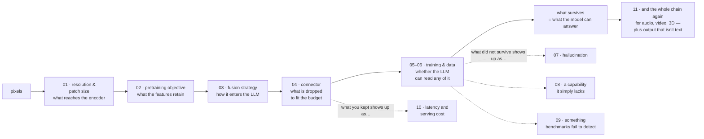

# Vision-Language Models

[← Back to curriculum index](../README.md)

A dedicated, end-to-end treatment of vision-language models: the vision encoder, the pretraining objective that gives its features meaning, the three ways vision enters a language model, the connector that pays for it in tokens, the staged training pipeline, the instruction data, hallucination and alignment, the capability families that matter in production, evaluation, serving — and finally multimodality beyond vision.

[Phase 10 Lesson 1](../Phase-10-Advanced-and-Frontier-Topics/01-Multimodal-LLMs/README.md) introduced the core idea (CLIP-style alignment plus LLaVA-style visual instruction tuning) in a single lesson. This phase is the deep dive that lesson previews, and it assumes it: start there if you have not read it.

Every lesson's `example.py` builds its subject from scratch in PyTorch on synthetic data and **measures** the effect being taught — the token-cost curves, the batch-size sensitivity of contrastive losses, the accuracy cost of token compression, catastrophic forgetting, hallucination rates before and after DPO, the resolution limit on reading small text, benchmark contamination, prefill-dominated latency, and emergent cross-modal alignment.

## Topics in this phase

| # | Topic |
|---|-------|
| 01 | [Vision Encoders and Image Tokenization](01-Vision-Encoders-and-Image-Tokenization/README.md) |
| 02 | [Vision-Language Pretraining Objectives](02-Vision-Language-Pretraining-Objectives/README.md) |
| 03 | [VLM Architectures and Fusion Strategies](03-VLM-Architectures-and-Fusion-Strategies/README.md) |
| 04 | [Connectors and Visual Token Compression](04-Connectors-and-Visual-Token-Compression/README.md) |
| 05 | [Training a VLM: the Staged Pipeline](05-Training-a-VLM-Staged-Pipeline/README.md) |
| 06 | [Visual Instruction Tuning and VLM Data](06-Visual-Instruction-Tuning-and-VLM-Data/README.md) |
| 07 | [VLM Hallucination and Alignment](07-VLM-Hallucination-and-Alignment/README.md) |
| 08 | [VLM Capabilities: Grounding, OCR, Documents, Video and GUIs](08-VLM-Capabilities-Grounding-OCR-Video-GUI/README.md) |
| 09 | [Evaluating VLMs](09-Evaluating-VLMs/README.md) |
| 10 | [VLM Inference and Deployment](10-VLM-Inference-and-Deployment/README.md) |
| 11 | [Beyond Vision: Full Multimodality](11-Beyond-Vision-Full-Multimodality/README.md) |

## The thread running through the phase

One trade-off recurs in every lesson, and it is worth naming up front: **an image's information has to survive a chain of lossy steps, and every step is priced in tokens.**

Resolution decides what reaches the encoder (01). The pretraining objective decides which of that the features retain (02). The fusion strategy decides how it enters the LLM and what it costs there (03). The connector decides how much is thrown away to fit the context budget (04). Training decides whether the LLM can read any of it without losing its text ability (05, 06). What is missing at the end of that chain is what the model hallucinates about (07), what it cannot read or point at (08), what benchmarks fail to detect (09), and what determines the serving bill (10). Lesson 11 shows the same chain running for audio, video and 3D — and one more step, where output stops being text.

## Prerequisites

- [Phase 02](../Phase-02-Transformer-Architecture-Deep-Dive/README.md) — attention, positional encoding, and the mini-Transformer this phase's examples reuse
- [Phase 03 Lesson 1](../Phase-03-LLM-Architectures-and-Types/01-Decoder-Only-Models-GPT-Family/README.md) — the decoder-only model every VLM here is built around
- [Phase 05 Lesson 4](../Phase-05-Finetuning-LLMs/04-Instruction-Tuning-SFT/README.md) — instruction tuning, extended to images in Lessons 05 and 06
- [Phase 06 Lesson 4](../Phase-06-Alignment-and-RLHF/04-Direct-Preference-Optimization-DPO/README.md) — DPO, applied to hallucination in Lesson 07
- [Phase 08](../Phase-08-Evaluation-of-LLMs/README.md) and [Phase 09](../Phase-09-Deployment-and-Inference-Optimization/README.md) — the evaluation and serving groundwork Lessons 09 and 10 modify
- [Phase 10 Lesson 1](../Phase-10-Advanced-and-Frontier-Topics/01-Multimodal-LLMs/README.md) — the overview this phase expands
